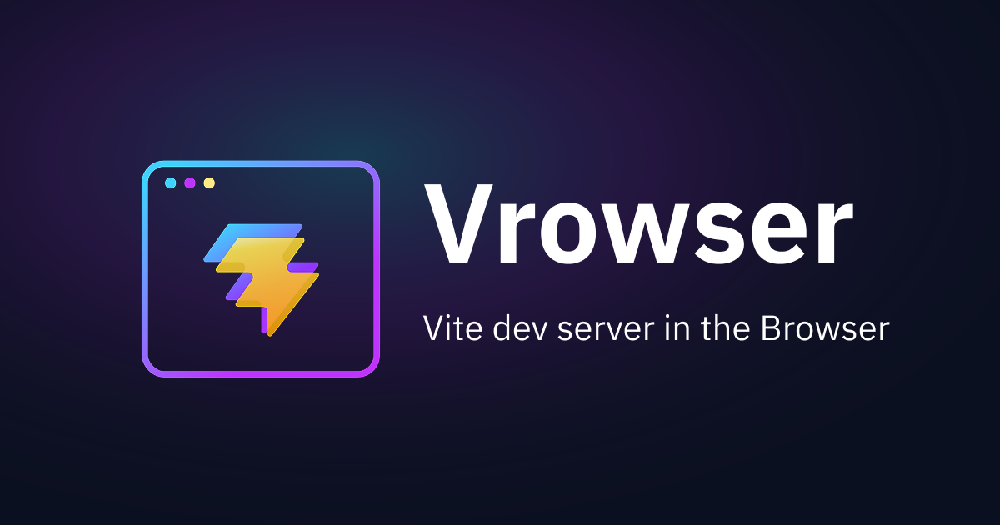

<h1 align="center">Vrowser</h1>

  

  <strong>Vite dev server in the Browser</strong>

  <em>/vraʊ.zɛr/ — Vite + Browser, inspired from French pronounce</em>

<!-- eslint-disable markdown/no-missing-label-refs -->

> [!WARNING]
> This project is under active development and is not yet ready for production use. APIs and features may change without notice.

<!-- eslint-enable markdown/no-missing-label-refs -->

## 🐱 Motivation

- Bundlers like Vite achieve HMR through a dev server and WebSocket connection, providing a development experience with live preview while coding
- However, current HMR implementations are WebSocket-based, so there's no existing solution that uses an in-browser bundler like rolldown to deliver Vite-like high-performance preview experiences
- This project was created to enable efficient, high-performance previews for no-code/low-code products using rolldown

## 📦 Packages

| Package                                                                          | Description                                                                                                                     |
| -------------------------------------------------------------------------------- | ------------------------------------------------------------------------------------------------------------------------------- |
| [vrowser](./packages/vrowser)                                                    | Embeddable live preview system with HMR, powered by Vite dev server in the browser                                              |
| [@vrowser/vite-plugin](./packages/vite-plugin)                                   | Vite plugin for vrowser                                                                                                         |
| [@vrowser/vite-dev-server](./packages/vite-dev-server)                           | Vite dev server for vrowser                                                                                                     |
| [@vrowser/rolldown](./packages/rolldown)                                         | Pre-bundled @rolldown/browser for easy browser usage                                                                            |
| [@vrowser/fs](./packages/fs)                                                     | Browser-compatible filesystem using memfs for vrowser                                                                           |
| [@vrowser/node-polyfill](./packages/node-polyfill)                               | Browser-compatible Node.js module polyfills for vrowser                                                                         |
| [@vrowser/service-worker](./packages/service-worker)                             | Safely deploy and manage Service Workers with version control, bidirectional communication, and emergency shutdown capabilities |
| [@vrowser/service-worker-server](./packages/service-worker-server)               | Serverized service worker with the Node Server interface                                                                        |
| [@vrowser/unplugin-service-worker](./packages/unplugin-service-worker)           | unplugin for `@vrowser/service-worker`                                                                                          |
| [@vrowser/oxlint-plugin-service-worker](./packages/oxlint-plugin-service-worker) | Oxlint plugin for `@vrowser/service-worker`                                                                                     |

## ✅ TODO

List is [here](TODO.md)

## ©️ License

[MIT](http://opensource.org/licenses/MIT)
