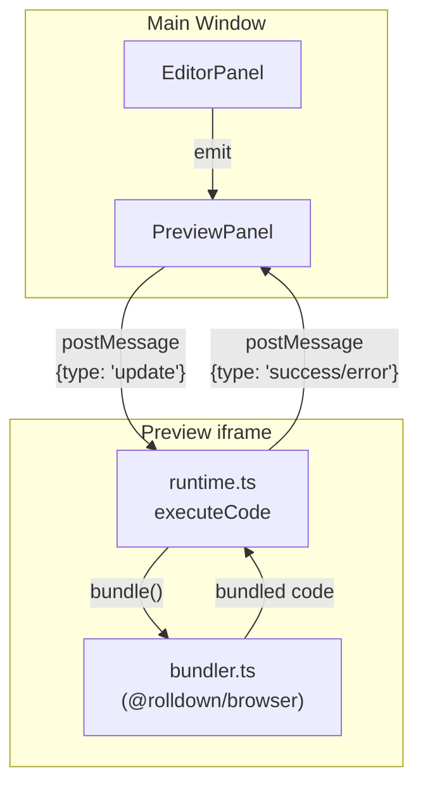
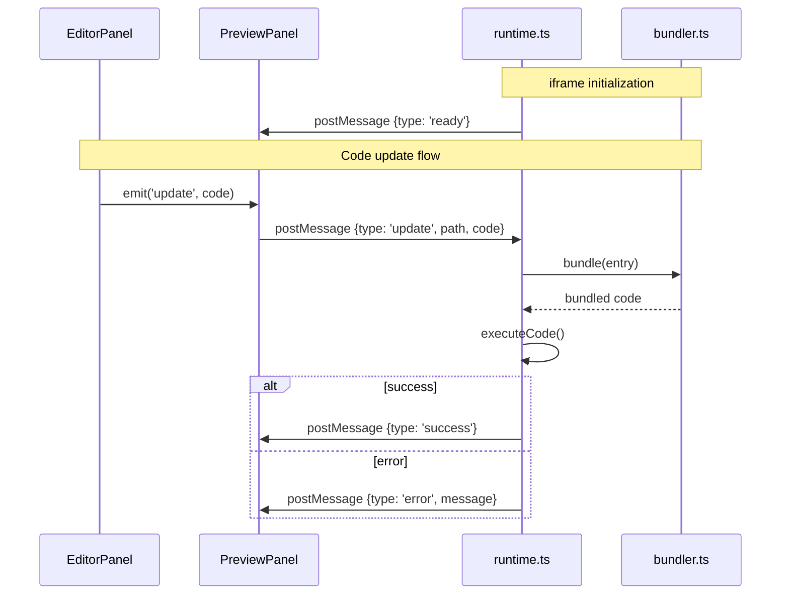
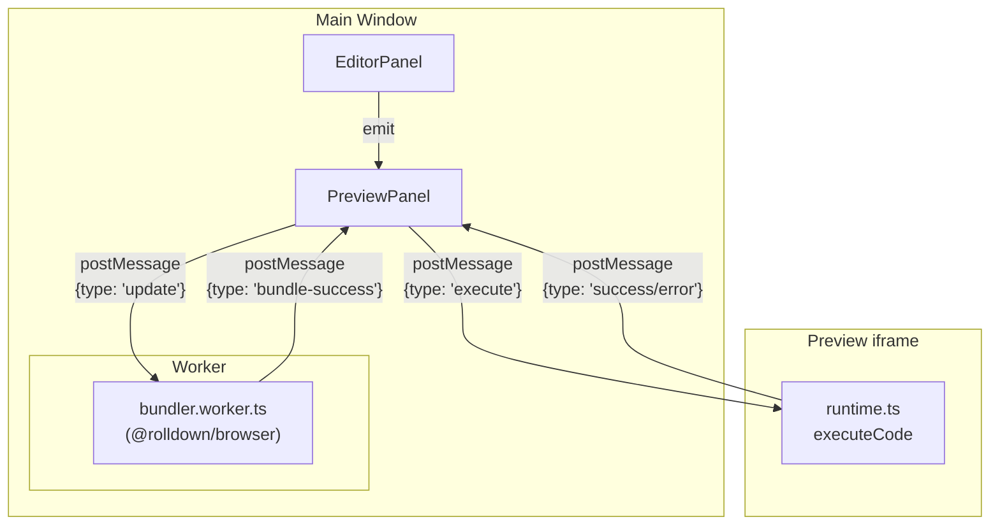
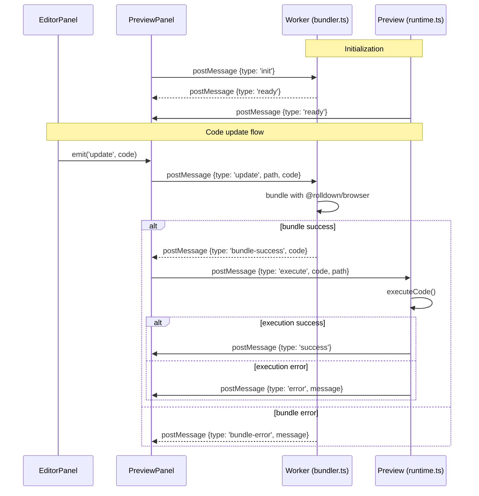
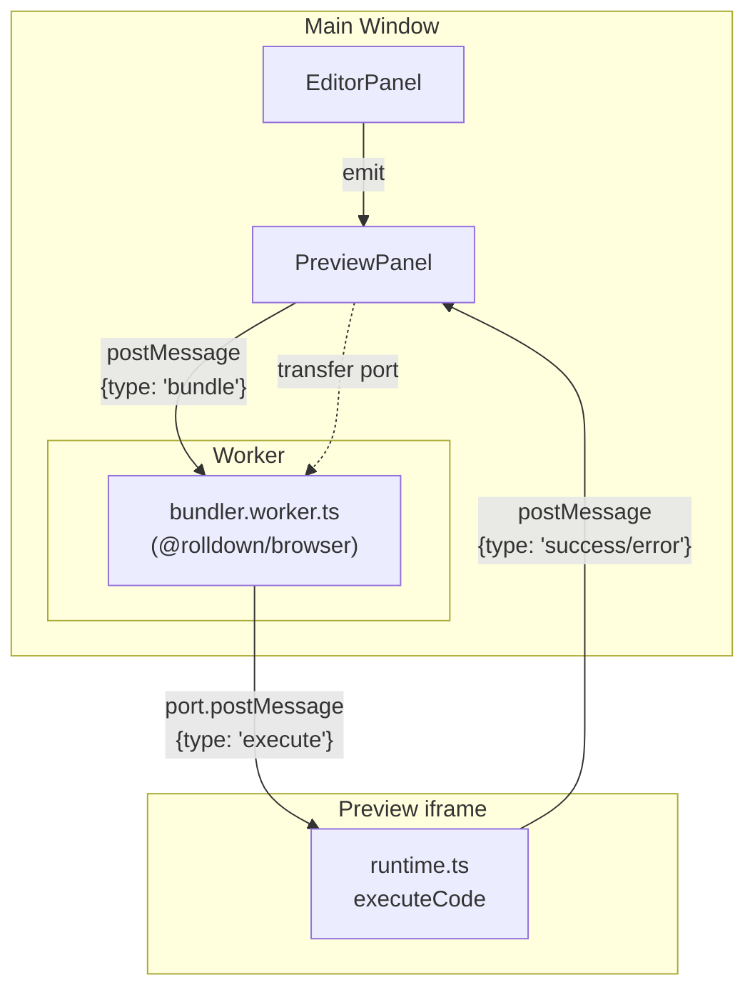
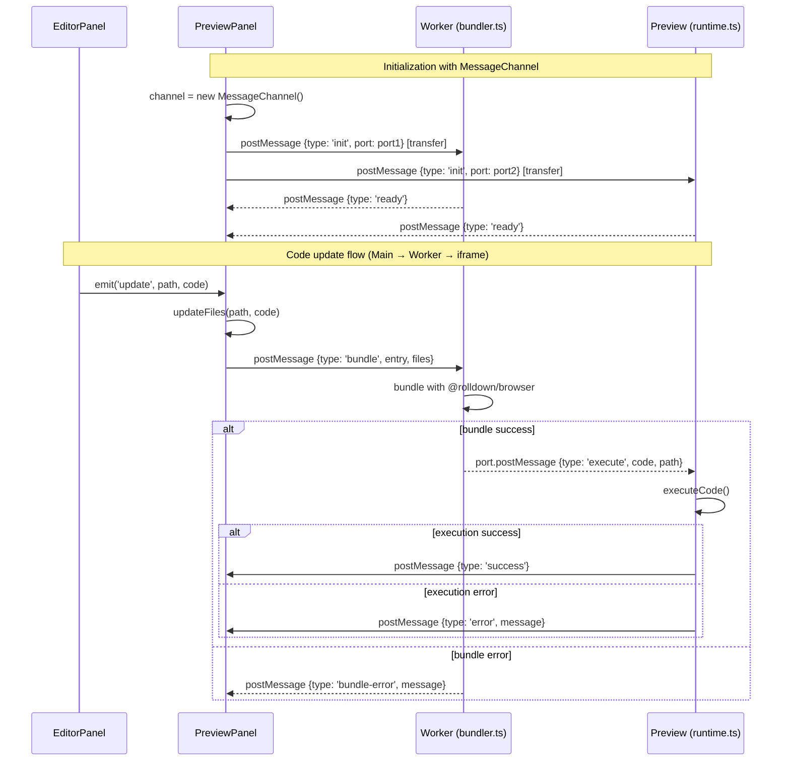
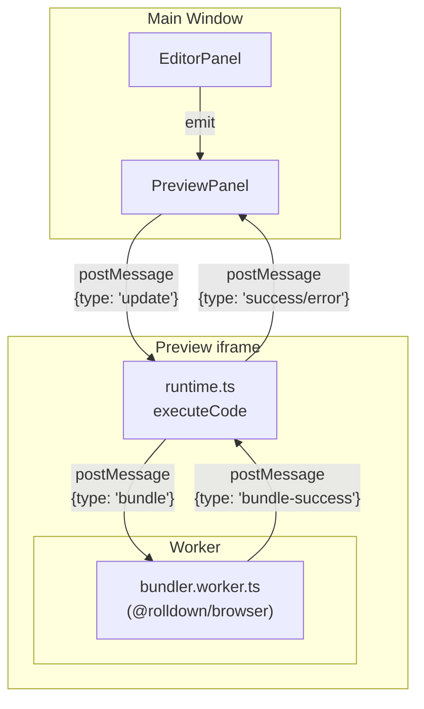
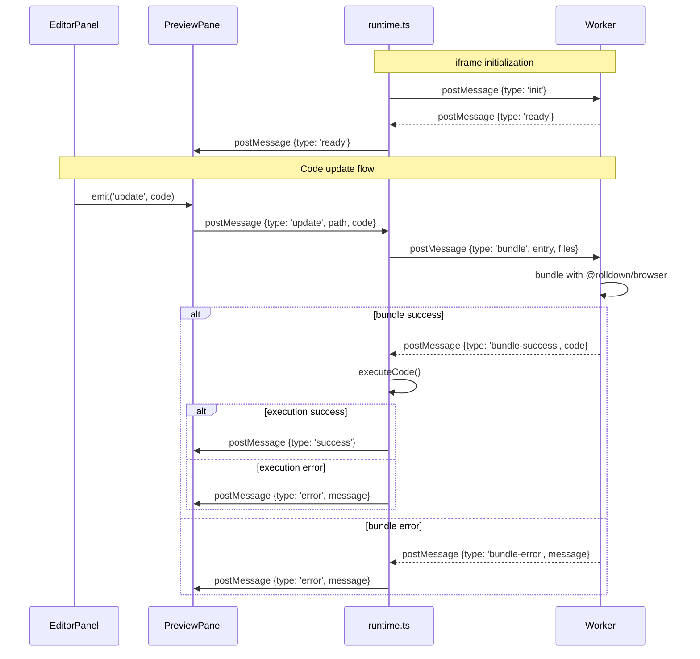

# HMR Worker Architecture Design

## Current Architecture



### Current Message Protocol

| Direction     | Type      | Payload                          |
| ------------- | --------- | -------------------------------- |
| Main → iframe | `update`  | `{ path: string, code: string }` |
| iframe → Main | `ready`   | `{}`                             |
| iframe → Main | `success` | `{}`                             |
| iframe → Main | `error`   | `{ message: string }`            |

### Sequence Diagram (Current)



---

## Option A: Main Window → Worker → Preview iframe



### Message Protocol (Option A)

**Main ↔ Worker:**

| Direction     | Type             | Payload                          |
| ------------- | ---------------- | -------------------------------- |
| Main → Worker | `init`           | `{}`                             |
| Worker → Main | `ready`          | `{}`                             |
| Main → Worker | `update`         | `{ path: string, code: string }` |
| Worker → Main | `bundle-success` | `{ code: string }`               |
| Worker → Main | `bundle-error`   | `{ message: string }`            |

**Main ↔ iframe:**

| Direction     | Type      | Payload                          |
| ------------- | --------- | -------------------------------- |
| Main → iframe | `execute` | `{ code: string, path: string }` |
| iframe → Main | `ready`   | `{}`                             |
| iframe → Main | `success` | `{}`                             |
| iframe → Main | `error`   | `{ message: string }`            |

### Sequence Diagram (Option A)



### Pros

- **Separation of concerns**: Worker handles bundling only, iframe handles execution only
- **Worker reusability**: Worker can be shared across multiple preview iframes
- **Easier debugging**: Both Worker and iframe can be monitored from Main window
- **No SharedArrayBuffer in iframe**: COOP/COEP headers may not be required for iframe

### Cons

- **Complex communication**: Main window acts as a relay
- **More message hops**: Editor → Main → Worker → Main → iframe
- **Distributed state management**: State needs to be managed in both Worker and iframe

---

## Option A': Option A with MessageChannel (Main → Worker → iframe Direct)

Using the MessageChannel API, Worker can send bundled code directly to iframe after receiving bundle requests from Main window. This eliminates the inefficiency of routing code through iframe for bundling.

### MessageChannel Overview

The MessageChannel API creates a pair of connected MessagePort objects that can be transferred to different contexts (Worker, iframe) for direct communication.



### Message Protocol (Option A')

**Main → Worker:**

| Direction     | Type     | Payload                                            |
| ------------- | -------- | -------------------------------------------------- |
| Main → Worker | `init`   | `{ port: MessagePort }` (transferred)              |
| Worker → Main | `ready`  | `{}`                                               |
| Main → Worker | `bundle` | `{ entry: string, files: Record<string, string> }` |

**Worker → iframe:** (via MessagePort, direct)

| Direction       | Type      | Payload                          |
| --------------- | --------- | -------------------------------- |
| Worker → iframe | `execute` | `{ code: string, path: string }` |

**iframe → Main:** (status reporting)

| Direction     | Type      | Payload               |
| ------------- | --------- | --------------------- |
| iframe → Main | `ready`   | `{}`                  |
| iframe → Main | `success` | `{}`                  |
| iframe → Main | `error`   | `{ message: string }` |

**Worker → Main:** (error reporting)

| Direction     | Type           | Payload               |
| ------------- | -------------- | --------------------- |
| Worker → Main | `bundle-error` | `{ message: string }` |

### Sequence Diagram (Option A')



### Code Examples

**Main Window (PreviewPanel.vue):**

```typescript
// File state management
const files: Record<string, string> = {
  '/main.js': 'console.log("Hello")'
}

// Create MessageChannel
const channel = new MessageChannel()

// Transfer port1 to Worker (for sending bundled code to iframe)
worker.postMessage({ type: 'init', port: channel.port1 }, [channel.port1])

// Transfer port2 to iframe (for receiving bundled code from Worker)
iframe.contentWindow.postMessage({ type: 'init', port: channel.port2 }, '*', [channel.port2])

// Handle code updates from editor
function onCodeUpdate(path: string, code: string) {
  files[path] = code
  // Send bundle request directly to Worker
  worker.postMessage({
    type: 'bundle',
    entry: '/main.js',
    files: { ...files }
  })
}

// Handle Worker errors
worker.onmessage = e => {
  if (e.data.type === 'bundle-error') {
    console.error('Bundle error:', e.data.message)
  }
}
```

**Worker (bundler.worker.ts):**

```typescript
let iframePort: MessagePort | null = null

self.onmessage = async e => {
  if (e.data.type === 'init' && e.data.port) {
    iframePort = e.data.port
    self.postMessage({ type: 'ready' })
  } else if (e.data.type === 'bundle') {
    try {
      const code = await bundle(e.data.entry, e.data.files)
      // Send bundled code directly to iframe
      iframePort?.postMessage({
        type: 'execute',
        code,
        path: e.data.entry
      })
    } catch (err) {
      // Report error to Main
      self.postMessage({ type: 'bundle-error', message: String(err) })
    }
  }
}
```

**iframe (runtime.ts):**

```typescript
let workerPort: MessagePort | null = null

window.onmessage = e => {
  if (e.data.type === 'init' && e.data.port) {
    workerPort = e.data.port
    workerPort.onmessage = handleExecute
    window.parent.postMessage({ type: 'ready' }, '*')
  }
}

function handleExecute(e: MessageEvent) {
  if (e.data.type === 'execute') {
    try {
      executeCode(e.data.code, e.data.path)
      window.parent.postMessage({ type: 'success' }, '*')
    } catch (err) {
      window.parent.postMessage({ type: 'error', message: String(err) }, '*')
    }
  }
}
```

### Pros

- **Efficient data flow**: Code goes directly from Main → Worker → iframe without unnecessary hops
- **Main thread manages file state**: All file state is managed in PreviewPanel, not distributed
- **Direct Worker → iframe communication**: Bundled code is sent directly to iframe via MessagePort
- **Separation of concerns**: Worker handles bundling, iframe handles execution only
- **Worker reusability**: Worker can be shared across multiple preview iframes

### Cons

- **Slightly more complex setup**: MessageChannel initialization required
- **Port management**: Need to handle port lifecycle
- **Bundle errors route through Main**: Error reporting still goes through Main window

---

## Option B: Preview iframe → Worker → Preview iframe



### Message Protocol (Option B)

**Main ↔ iframe:** (unchanged)

| Direction     | Type      | Payload                          |
| ------------- | --------- | -------------------------------- |
| Main → iframe | `update`  | `{ path: string, code: string }` |
| iframe → Main | `ready`   | `{}`                             |
| iframe → Main | `success` | `{}`                             |
| iframe → Main | `error`   | `{ message: string }`            |

**iframe ↔ Worker:** (new)

| Direction       | Type             | Payload                                            |
| --------------- | ---------------- | -------------------------------------------------- |
| iframe → Worker | `init`           | `{}`                                               |
| Worker → iframe | `ready`          | `{}`                                               |
| iframe → Worker | `bundle`         | `{ entry: string, files: Record<string, string> }` |
| Worker → iframe | `bundle-success` | `{ code: string }`                                 |
| Worker → iframe | `bundle-error`   | `{ message: string }`                              |

### Sequence Diagram (Option B)



### Pros

- **Minimal changes**: Main window code remains mostly unchanged
- **Encapsulation**: Bundling logic stays within the iframe
- **Preserves existing structure**: Current message protocol is not broken

### Cons

- **Worker creation in iframe**: Depends on iframe security settings
- **COOP/COEP required**: Headers needed for iframe when using SharedArrayBuffer
- **Worker reuse is difficult**: Each iframe requires its own Worker instance

---

## Recommendation: Option A' (Option A with MessageChannel)

### Rationale

1. **Easier COOP/COEP management**: Only needs to be configured for Main window
2. **Future extensibility**: Easier to support multiple files and multiple previews
3. **Debugging convenience**: Worker can be directly monitored from DevTools
4. **Clear separation of concerns**: bundling vs execution
5. **Direct communication**: MessageChannel enables Worker ↔ iframe direct messaging after setup
6. **Better HMR performance**: Reduced message hops for frequent code updates

---

## Files to Modify

| File                              | Changes                                     |
| --------------------------------- | ------------------------------------------- |
| `src/worker/bundler.worker.ts`    | New file - Worker implementation            |
| `src/components/PreviewPanel.vue` | Add Worker creation and communication logic |
| `src/preview/runtime.ts`          | Remove bundle calls, keep only executeCode  |
| `src/preview/bundler.ts`          | Rewrite for Worker or delete                |
| `vite.config.ts`                  | Add Worker configuration (if needed)        |

---

## Implementation Steps

1. **Create Worker**: Create `bundler.worker.ts` with @rolldown/browser initialization and bundling logic
2. **Update PreviewPanel**: Add Worker creation and message handling
3. **Simplify runtime.ts**: Remove bundling, keep only executeCode
4. **Implement message protocol**: Implement the new protocol defined above
5. **Test**: Verify HMR functionality works correctly
