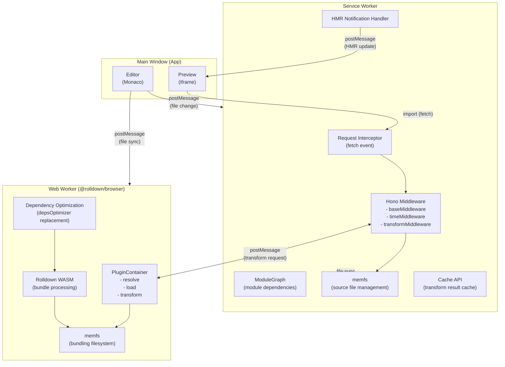
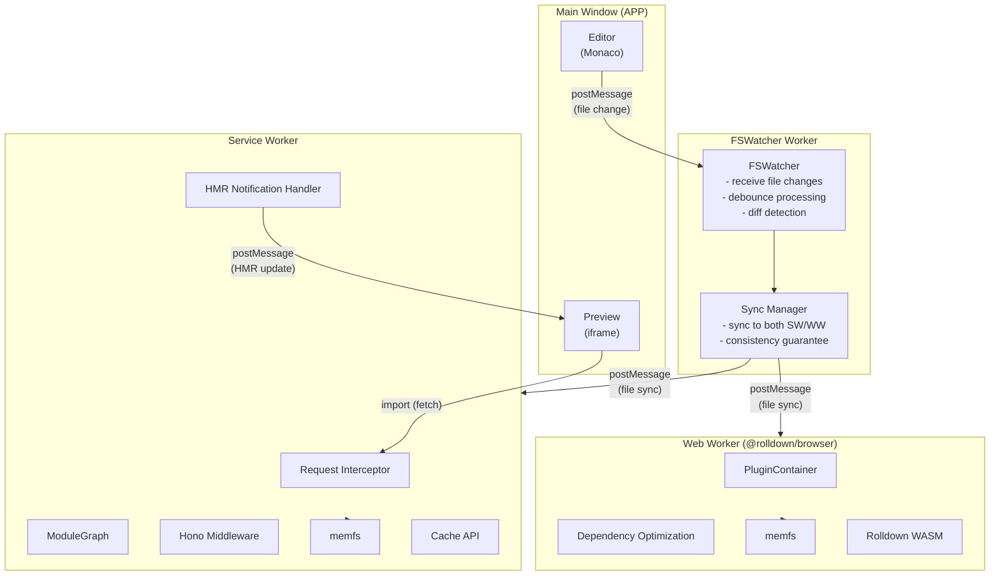
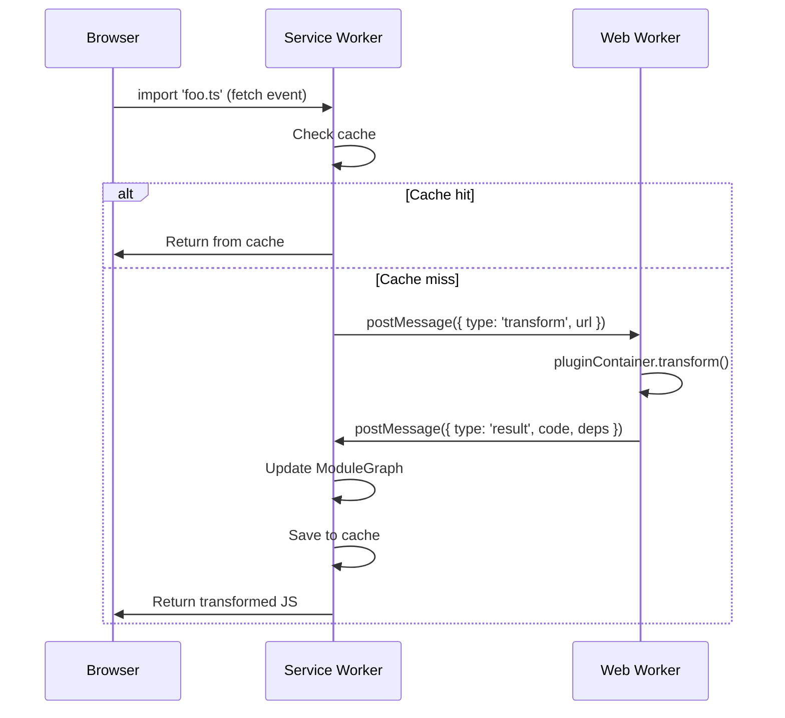
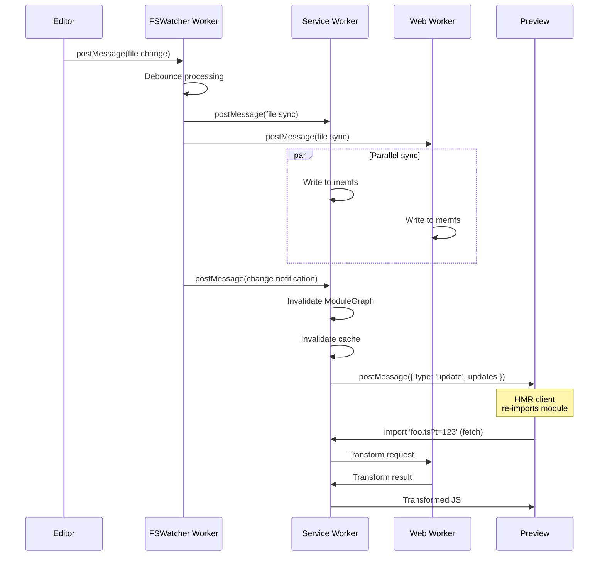
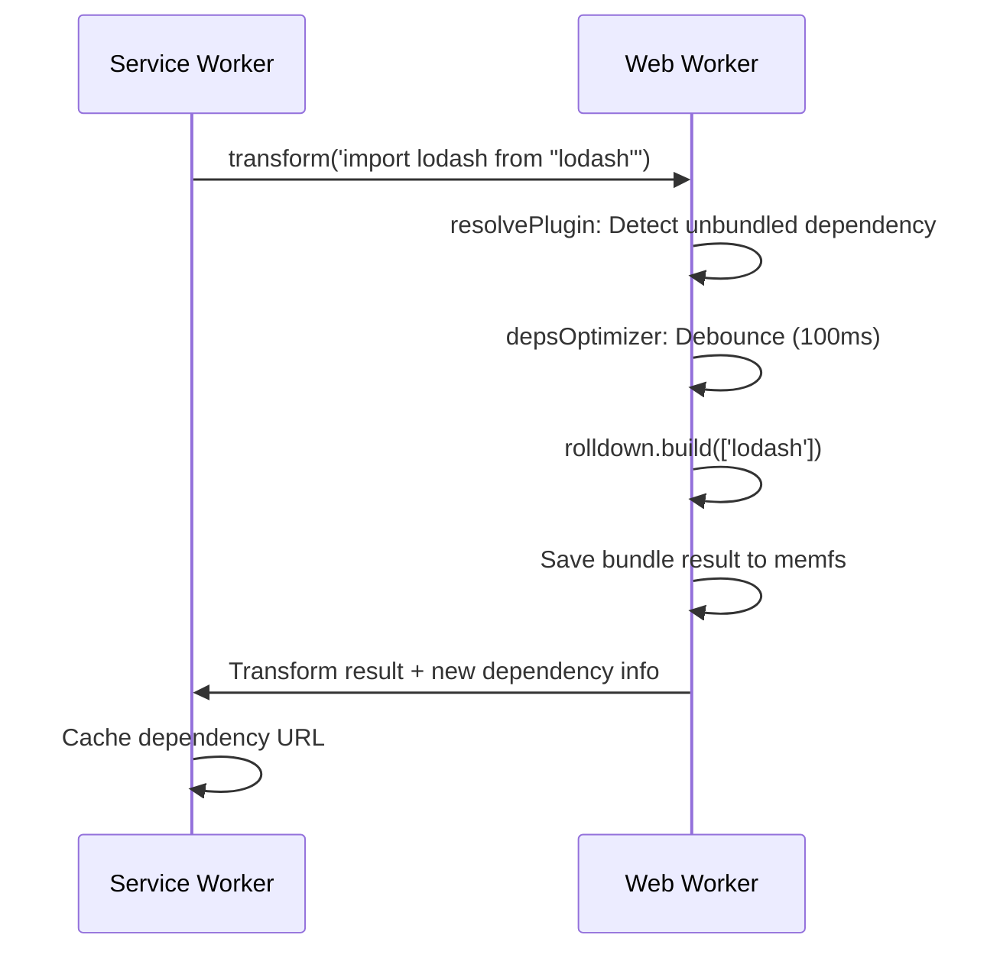

# Browser HMR Architecture with Service Worker v0.2

## Overview

Use Service Worker to intercept import requests and implement Vite-compatible HMR in the browser. Dependency bundling is handled within a Web Worker using @rolldown/browser (WASM + memfs) to work around Service Worker limitations.

**Key changes from previous version:**

- Incorporated depsOptimizer research findings
- Adopted rolldown memfs + Web Worker architecture
- Incorporated Hono-based middleware implementation
- Added IPC buffer limitations and postMessage + Transferable approach

---

## Package Structure

| Package                    | Role                                                                         |
| -------------------------- | ---------------------------------------------------------------------------- |
| `packages/vrowser`         | Preview using vite-dev-server                                                |
| `packages/vite-dev-server` | Hono-based vite-dev-server                                                   |
| `packages/play-dev-server` | Playground for vite-dev-server                                               |
| `packages/playground`      | Prototype Playground using ported Vite plugins, ModuleGraph, PluginContainer |

---

## Design Option A: Direct Communication Architecture

Application (editor) sends file information directly to both Service Worker and Web Worker.

### Design Option A Characteristics

| Aspect                  | Evaluation                               |
| ----------------------- | ---------------------------------------- |
| **Simplicity**          | Fewer Workers, clear communication paths |
| **Latency**             | Minimal due to direct communication      |
| **App-side complexity** | Must be aware of both SW/WW              |
| **Consistency**         | App must manage synchronization of both  |

---

## Design Option B: Unified File Sync via FSWatcher Worker

Introduce an **FSWatcher Worker** equivalent to Vite's FSWatcher (chokidar) to centrally manage file synchronization.

### Design Option B Characteristics

| Aspect                     | Evaluation                                               |
| -------------------------- | -------------------------------------------------------- |
| **Separation of concerns** | Application only communicates with FSWatcher             |
| **Vite alignment**         | Same role as Vite's FSWatcher (chokidar)                 |
| **Centralized management** | File sync logic consolidated in FSWatcher Worker         |
| **Extensibility**          | Debounce, diff detection can be implemented in FSWatcher |
| **Communication hops**     | App → FSW → SW/WW (1 additional hop)                     |

### FSWatcher Worker Responsibilities

| Responsibility            | Details                                 |
| ------------------------- | --------------------------------------- |
| **Receive file changes**  | Receive postMessage from application    |
| **Debounce processing**   | Batch consecutive changes (e.g., 100ms) |
| **Diff detection**        | Sync only changed files                 |
| **SW/WW sync**            | Sync files to memfs in both Workers     |
| **Consistency guarantee** | Confirm sync completion in both SW/WW   |
| **Change notification**   | Notify SW to trigger HMR                |

---

## Design Options Comparison

| Aspect                         | Design A (Direct)    | Design B (FSWatcher)     |
| ------------------------------ | -------------------- | ------------------------ |
| Worker count                   | 2 (SW + WW)          | 3 (SW + WW + FSW)        |
| Communication hops             | 1                    | 2                        |
| App-side complexity            | High (aware of both) | Low (FSW only)           |
| Sync consistency               | Managed by app       | Centrally managed by FSW |
| Debounce                       | Implemented in app   | Implemented in FSW       |
| Conceptual alignment with Vite | Low                  | High                     |

---

## Responsibility Distribution

### Service Worker

- **Request interception**: Handle fetch events for `/src/*`, `/@vite/*`, etc.
- **Hono middleware execution**: baseMiddleware, timeMiddleware, transformMiddleware
- **ModuleGraph management**: Track module dependencies
- **HMR notification**: Detect file changes, identify affected modules, notify clients
- **memfs**: Source file management
- **Cache API**: Cache transform results (ETag, 304 responses)

### Web Worker (@rolldown/browser)

- **PluginContainer**: resolveId, load, transform
- **Dependency optimization**: rolldown.scan(), rolldown.build()
- **memfs management**: Manage source and dependencies in virtual filesystem
- **oxcPlugin equivalent**: TypeScript/JSX transformation

### FSWatcher Worker (Design Option B only)

- **Receive file changes**: Receive notifications from application
- **Debounce processing**: Batch consecutive changes
- **SW/WW sync**: Sync files to both Workers
- **Change notification**: Notify SW to trigger HMR

---

## Vite depsOptimizer Replacement

### Mapping to Vite (ref: 025-vite-deps-optimizer.md)

| Feature           | Vite Implementation             | Playground Replacement             |
| ----------------- | ------------------------------- | ---------------------------------- |
| Dependency scan   | `discoverProjectDependencies()` | rolldown.scan() in Web Worker      |
| Bundle            | `runOptimizeDeps()` (Rolldown)  | rolldown.build() in Web Worker     |
| Dynamic discovery | `registerMissingImport()`       | Detect and bundle in resolvePlugin |
| Cache             | Filesystem                      | Cache API                          |
| File watching     | FSWatcher (chokidar)            | postMessage from editor            |

---

## File Change Detection (FSWatcher Replacement)

### Differences from Vite (ref: 027-fswatcher-depsoptimizer-relation.md)

| Vite                  | Playground                                  |
| --------------------- | ------------------------------------------- |
| FSWatcher (chokidar)  | postMessage from editor                     |
| node_modules watching | Not needed (CDN or pre-bundled)             |
| lockfile watching     | Not needed (package.json managed by editor) |

---

## IPC Limitations and Data Transfer (ref: 026-rolldown-memfs.md)

### @napi-rs/wasm-runtime IPC Limitations

- SharedArrayBuffer: 16 + 10240 bytes (~10KB)
- This limitation only applies to fs-proxy communication between Workers

### Recommended: postMessage + Transferable

Use `postMessage` + `Transferable` objects (ArrayBuffer, etc.) for large file transfers to bypass IPC limitations.

---

## Dependency Handling Strategy

| Strategy               | Pros                                 | Cons                           |
| ---------------------- | ------------------------------------ | ------------------------------ |
| **CDN (esm.sh, etc.)** | Easy implementation, cache efficient | No offline, version management |
| **Pre-bundled**        | Fast, offline support                | Less flexible                  |
| **@rolldown/browser**  | Full features, dynamic support       | Init time, memory usage        |
| **Hybrid**             | Good balance                         | Complexity                     |

### Recommended: Hybrid Approach

1. **Common dependencies**: Pre-bundled in Cache API
2. **Dynamic dependencies**: On-demand bundling with @rolldown/browser
3. **Fallback**: Redirect to esm.sh

---

## COOP/COEP Requirements

The following headers are required to use SharedArrayBuffer:

- `Cross-Origin-Opener-Policy: same-origin`
- `Cross-Origin-Embedder-Policy: require-corp`

---

## Message Flows

### Import Request Flow

### HMR Flow (Design Option B: FSWatcher)

### Dependency Discovery Flow

