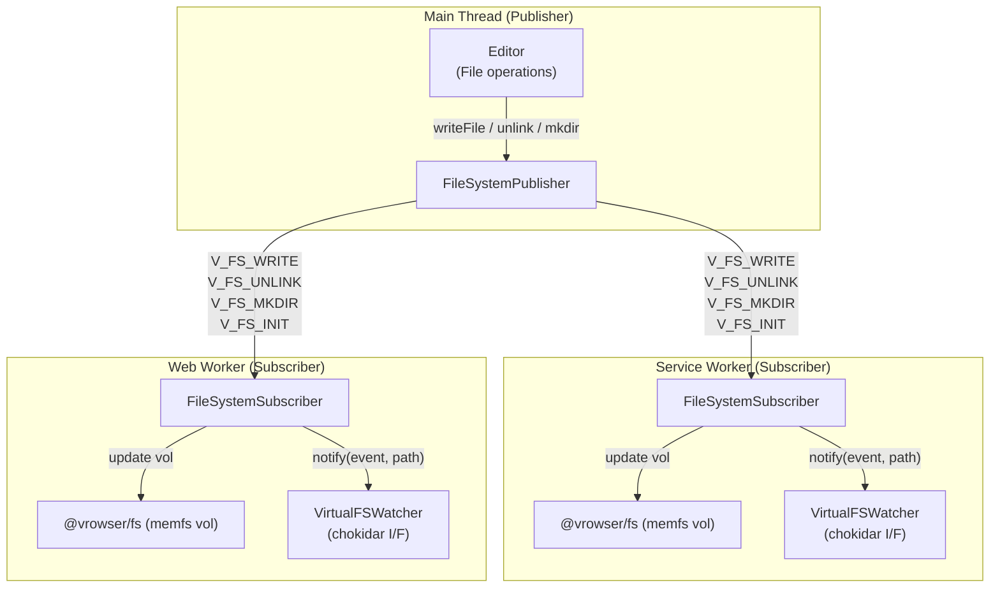

# @vrowser/fs

Browser-compatible filesystem using memfs for vrowser.

## ✨ Features

- Full Node.js `fs` API compatibility via memfs
- Browser/Service Worker ready
- `node:fs` and `node:fs/promises` compatible entry points
- Dynamic `process.cwd()` / `process.chdir()` support
- Virtual filesystem watcher with Pub-Sub sync protocol
- TypeScript support with full type definitions

## 💿 Installation

```sh
# npm
npm install --save @vrowser/fs

# pnpm
pnpm add @vrowser/fs

# yarn
yarn add @vrowser/fs

# deno
deno add npm:@vrowser/fs

# bun
bun add @vrowser/fs
```

## 🚀 Usage

### Direct Usage

```ts
import { vol, writeFileSync, readFileSync, chdir, cwd } from '@vrowser/fs'

// Initialize filesystem from JSON
vol.fromJSON({
  '/src/index.ts': 'export const hello = "world"',
  '/src/utils.ts': 'export function add(a, b) { return a + b }'
})

// Change working directory
chdir('/src')
console.log(cwd()) // '/src'

// Read file with relative path
const content = readFileSync('./index.ts', 'utf8')
console.log(content) // 'export const hello = "world"'
```

### As `node:fs` Polyfill (Vite/Rolldown)

```ts
// `vite.config.js` or `rolldown.config.js`
export default defineConfig({
  resolve: {
    alias: {
      'node:fs': '@vrowser/fs',
      'node:fs/promises': '@vrowser/fs/promises',
      fs: '@vrowser/fs',
      'fs/promises': '@vrowser/fs/promises'
    }
  }
})
```

### Promises API

```ts
import { readFile, writeFile } from '@vrowser/fs/promises'

const content = await readFile('/path/to/file', 'utf8')
await writeFile('/path/to/output', 'Hello World')
```

## API

### Core Exports

- `Volume` - Volume class for creating isolated filesystems
- `vol` - Default volume instance
- `fs` - Default filesystem instance
- `createFsFromVolume(vol)` - Create fs interface from volume
- `memfs` - memfs factory function

### Process Utilities

- `cwd()` - Get current working directory
- `chdir(dir)` - Change current working directory
- `setCwd(dir)` - Set cwd directly
- `resetCwd()` - Reset cwd to '/'
- `process` - Custom process polyfill with cwd/chdir support

### Watcher (Pub-Sub Filesystem Sync)

Synchronize file operations from a Main Thread to Service Worker / Web Worker via `postMessage`, with chokidar-compatible watcher events.



#### Publisher (Main Thread)

```ts
import { createFileSystemPublisher } from '@vrowser/fs/watcher'

const publisher = createFileSystemPublisher([worker])

// node:fs-like API
publisher.writeFile('/main.js', 'export const x = 1') // text
publisher.writeFile('/image.png', arrayBuffer) // binary (zero-copy transfer)
publisher.unlink('/old-file.js')
publisher.mkdir('/new-dir')
publisher.initFiles({ '/main.js': 'code' }) // bulk init
```

#### Subscriber (Worker)

```ts
import { createFileSystemSubscriber } from '@vrowser/fs/watcher'

const { watcher, handleMessage } = createFileSystemSubscriber()

// Handle V_FS_* messages from Main Thread
self.addEventListener('message', event => {
  handleMessage(event.data)
})

// watcher is chokidar-compatible - use with DevEnvironment
watcher.on('change', path => console.log('changed:', path))
watcher.on('add', path => console.log('added:', path))
watcher.on('all', (event, path) => console.log(event, path))
```

#### VirtualFSWatcher

```ts
import { createVirtualFSWatcher } from '@vrowser/fs/watcher'

const watcher = createVirtualFSWatcher()

watcher.on('change', path => {
  /* ... */
})
watcher.notify('change', '/main.js') // triggers 'change' + 'all' events
```

### Entry Points

| Entry Point            | Description                                        |
| ---------------------- | -------------------------------------------------- |
| `@vrowser/fs`          | Main entry with all exports, `node:fs` compatibles |
| `@vrowser/fs/promises` | `node:fs/promises` compatible                      |
| `@vrowser/fs/watcher`  | Virtual filesystem watcher + Pub-Sub sync          |
| `@vrowser/fs/process`  | Custom process polyfill                            |

## 🤝 Sponsors

<p align="center">
  <a href="https://cdn.jsdelivr.net/gh/kazupon/sponsors/sponsors.svg">
    
  </a>
</p>

## ©️ License

[MIT](http://opensource.org/licenses/MIT)
