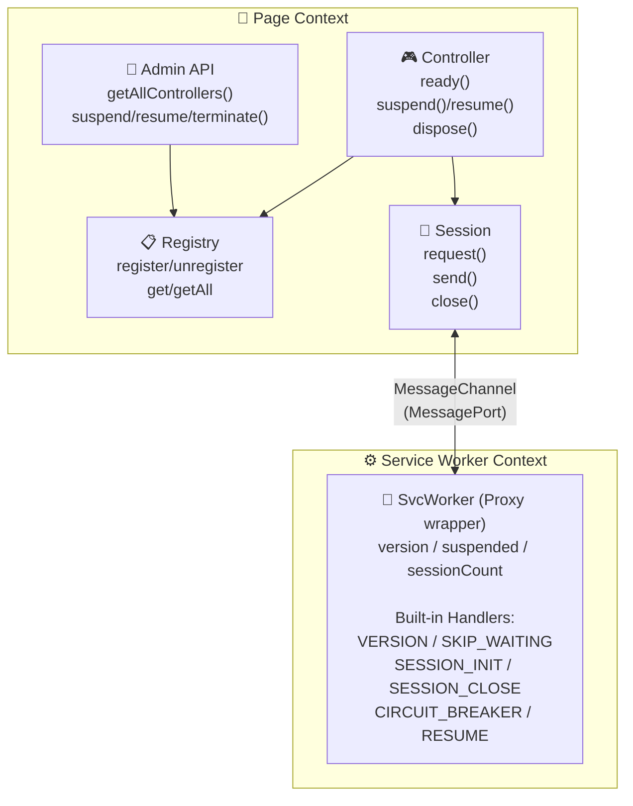
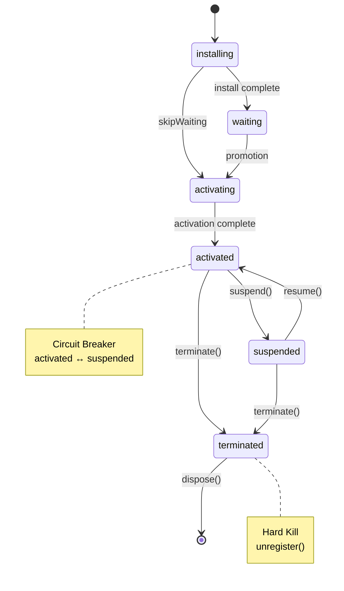
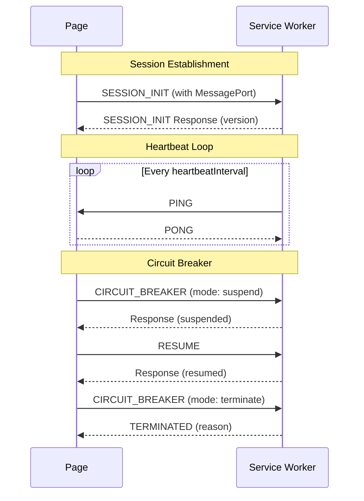

# @vrowser/service-worker

Safely deploy and manage Service Workers with version control, bidirectional communication, and emergency shutdown capabilities.

## ✨ Features

- ✅ **Version Management** - Tag and verify Service Worker versions for controlled updates
- ✅ **Persistent Sessions** - MessageChannel-based bidirectional communication between page and Service Worker
- ✅ **Kill Switch / Circuit Breaker** - Suspend (soft kill) or terminate (hard kill) Service Workers on demand
- ✅ **Singleton Controller** - One controller instance per scriptURL + version combination
- ✅ **State Management** - Track Service Worker lifecycle states with events
- ✅ **Heartbeat Monitoring** - Automatic session health checks and stale session cleanup
- ✅ **TypeScript First** - Full type definitions and type guards for all protocols

## 💿 Installation

```sh
# npm
npm install --save @vrowser/service-worker

# pnpm
pnpm add @vrowser/service-worker

# yarn
yarn add @vrowser/service-worker

# deno
deno add npm:@vrowser/service-worker

# bun
bun add @vrowser/service-worker
```

## 🚀 Usage

### Service Worker Controller

The controller manages Service Worker registration, version verification,
and lifecycle on the page side.

```ts
import { createSvcWorkerController } from '@vrowser/service-worker/controller'

const controller = createSvcWorkerController({
  scriptURL: '/sw.js',
  version: '1.0.0'
})

// Listen to state changes
controller.on('changeState', ({ state, version }) => {
  console.log(`State: ${state}, Version: ${version}`)
})

// Listen for reload suggestions (when Service Worker doesn't call clients.claim())
controller.on('reloadSuggested', ({ reason }) => {
  if (reason === 'unclaimed') {
    showReloadBanner()
  }
})

// Wait for Service Worker to become active
const success = await controller.ready({
  timeout: 5000,
  skipWaitingPolicy: 'strict' // or 'force'
})

if (success) {
  console.log('Service Worker is ready:', controller.version)
}
```

### Service Worker

Use `createSvcWorker` to wrap the Service Worker global scope. It provides a Proxy-based wrapper that transparently passes through all native `ServiceWorkerGlobalScope` APIs while adding version management and session handling.

```ts
// sw.js
import { createSvcWorker } from '@vrowser/service-worker/worker'

const sw = createSvcWorker(self, {
  version: '1.0.0',
  heartbeatInterval: 30000,
  sessionTimeout: 60000
})

// Use suspended flag for kill switch bypass
sw.addEventListener('fetch', (event) => {
  // When suspended, bypass all custom logic
  if (sw.suspended) {
    event.respondWith(fetch(event.request))
    return
  }

  // Normal fetch handling
  event.respondWith(handleFetch(event.request))
})

sw.addEventListener('activate', (event) => {
  event.waitUntil(self.clients.claim())
})
```

### Admin

The admin API provides centralized management for all registered controllers.

```ts
import {
  getAllControllers,
  getController,
  suspendServiceWorker,
  resumeServiceWorker,
  terminateServiceWorker,
  suspendAllServiceWorkers,
  terminateAllServiceWorkers
} from '@vrowser/service-worker/admin'

// List all registered controllers
const controllers = getAllControllers()
controllers.forEach(c => {
  console.log(`${c.scriptURL} v${c.version}: ${c.state}`)
})

// Suspend a specific Service Worker (soft kill)
const result = await suspendServiceWorker('/sw.js', '1.0.0', {
  clearCaches: true
})
console.log('Suspended:', result.mode === 'suspend')

// Resume after suspension
await resumeServiceWorker('/sw.js', '1.0.0')

// Terminate a Service Worker (hard kill - unregisters)
await terminateServiceWorker('/sw.js', '1.0.0', {
  clearCaches: true
})

// Emergency: suspend all Service Workers
await suspendAllServiceWorkers()

// Emergency: terminate all Service Workers
await terminateAllServiceWorkers({ clearCaches: true })
```

## 🏛️ Architecture



### State Diagram



### Message Protocols

Communication between Page and Service Worker uses the following message protocols:

#### Core Protocols (via postMessage)

| Protocol            | Direction                    | Description                                    |
| ------------------- | ---------------------------- | ---------------------------------------------- |
| `V_SW_VERSION`      | Page → Service Worker → Page | Version verification request/response          |
| `V_SW_SKIP_WAITING` | Page → Service Worker        | Request Service Worker to call `skipWaiting()` |

#### Session Protocols (via MessagePort)

| Protocol             | Direction                    | Description                                    |
| -------------------- | ---------------------------- | ---------------------------------------------- |
| `V_SW_SESSION_INIT`  | Page → Service Worker → Page | Establish persistent session with version info |
| `V_SW_SESSION_CLOSE` | Page → Service Worker        | Close the session gracefully                   |
| `V_SW_SESSION_PING`  | Service Worker → Page        | Heartbeat ping from Service Worker             |
| `V_SW_SESSION_PONG`  | Page → Service Worker        | Heartbeat pong response                        |

#### Circuit Breaker Protocols (via MessagePort)

| Protocol                       | Direction                    | Description                                       |
| ------------------------------ | ---------------------------- | ------------------------------------------------- |
| `V_SW_SESSION_CIRCUIT_BREAKER` | Page → Service Worker → Page | Suspend or terminate Service Worker               |
| `V_SW_SESSION_RESUME`          | Page → Service Worker → Page | Resume suspended Service Worker                   |
| `V_SW_SESSION_TERMINATED`      | Service Worker → Page        | Notification that Service Worker has unregistered |



## 📖 Details of Features

### Versioning

Each Service Worker must declare a version tag that the controller uses to
identify and verify the expected Service Worker.

**How it works:**

1. Controller sends `V_SW_VERSION` message to Service Worker
2. Service Worker responds with its version via MessagePort
3. Controller verifies the version matches before proceeding

**Version verification occurs:**

- When checking if current controller is the expected version
- During Service Worker promotion (installing → waiting → active)
- When establishing a session

```ts
// Page side
const controller = createSvcWorkerController({
  scriptURL: '/sw.js',
  version: '2.0.0' // Expected version
})

// Service Worker side
const sw = createSvcWorker(self, {
  version: '2.0.0' // Must match
})
```

**Singleton Pattern:**
Controllers are cached by `scriptURL::version` key. Creating a controller
with the same scriptURL and version returns the existing instance.

### Kill Switch

The kill switch (circuit breaker) provides two modes for controlling
Service Workers:

#### Suspend (Soft Kill)

Disables Service Worker functionality without unregistering it.

```ts
// Via controller
await controller.suspend({ clearCaches: true })

// Via admin API
await suspendServiceWorker('/sw.js', '1.0.0')
```

**Behavior:**

- Sets `sw.suspended = true` on Service Worker side
- Optionally clears all caches
- Service Worker remains registered
- Fetch handlers should check `sw.suspended` and bypass logic
- State changes to `'suspended'`
- Emits `'suspended'` event

#### Resume

Restores Service Worker functionality after suspension.

```ts
// Via controller
await controller.resume()

// Via admin API
await resumeServiceWorker('/sw.js', '1.0.0')
```

**Behavior:**

- Sets `sw.suspended = false` on Service Worker side
- State changes back to `'activated'`
- Emits `'resumed'` event

#### Terminate (Hard Kill)

Unregisters the Service Worker completely.

```ts
// Via admin API only
await terminateServiceWorker('/sw.js', '1.0.0', {
  clearCaches: true
})
```

**Behavior:**

- Optionally clears all caches
- Calls `self.registration.unregister()` on Service Worker side
- Notifies all connected sessions with `TERMINATED` message
- State changes to `'terminated'`
- Emits `'terminated'` event with reason
- Controller is removed from registry

### Service Worker Management

#### Controller Lifecycle

```ts
const controller = createSvcWorkerController({ scriptURL, version })

// 1. Wait for activation
await controller.ready()

// 2. Use Service Worker
// ... application logic ...

// 3. Suspend if needed (recoverable)
await controller.suspend()

// 4. Resume when ready
await controller.resume()

// 5. Dispose when done
controller.dispose()
```

#### Events

| Event             | Payload                             | Description                      |
| ----------------- | ----------------------------------- | -------------------------------- |
| `progress`        | `string`                            | Debug/UI progress phases         |
| `changeState`     | `{ state, version, serviceWorker }` | State transitions                |
| `reloadSuggested` | `{ reason, version }`               | Reload needed (no clients.claim) |
| `suspended`       | `void`                              | Service Worker suspended         |
| `resumed`         | `void`                              | Service Worker resumed           |
| `terminated`      | `SvcWorkerTerminatedReason`         | Service Worker unregistered      |

#### Heartbeat & Session Cleanup

- Service Worker sends `PING` to all sessions at configured interval
- Page responds with `PONG`
- Sessions without `PONG` response within timeout are cleaned up
- Stale sessions (disconnected clients) are automatically removed

## 📦 Exports

| Entry Point                          | Description                                 |
| ------------------------------------ | ------------------------------------------- |
| `@vrowser/service-worker`            | Main entry (admin + controller + protocols) |
| `@vrowser/service-worker/admin`      | Admin API only                              |
| `@vrowser/service-worker/controller` | Controller only                             |
| `@vrowser/service-worker/worker`     | Service Worker wrapper                      |
| `@vrowser/service-worker/protocols`  | Message protocols and types                 |

## 📚 API References

See the [API References](./docs/index.md)

## 🤝 Sponsors

<p align="center">
  <a href="https://github.com/sponsors/kazupon">
    
  </a>
</p>

## ©️ License

[MIT](http://opensource.org/licenses/MIT)
