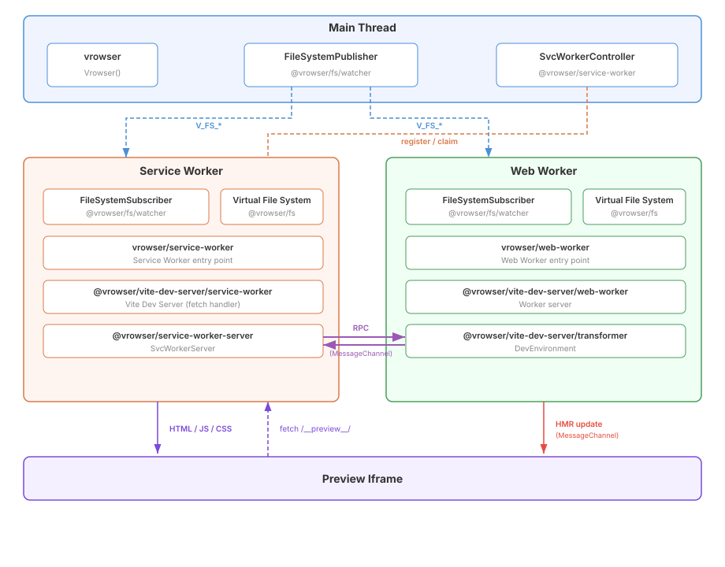

# vrowser

Vite dev server in the browser.

Embeddable live preview system with HMR support. Mount a Vite-powered preview iframe into your app with a simple API — no back-end server required.

## 💿 Installation

```sh
# npm
npm install vrowser

# pnpm
pnpm add vrowser

# yarn
yarn add vrowser
```

You also need the Vite plugin:

```sh
pnpm add -D @vrowser/vite-plugin
```

## 🚀 Usage

### 1. Configure Vite

```ts
// vite.config.ts
import { Vrowser } from '@vrowser/vite-plugin'
import { defineConfig } from 'vite'

export default defineConfig({
  plugins: [
    Vrowser({
      serviceWorkerEntry: './node_modules/vrowser/dist/service-worker.ts'
    })
  ]
})
```

### 2. Use in your app

```ts
import { Vrowser } from 'vrowser'

const vrowser = Vrowser({ basePath: '/__preview__/' })

// Initialize with files
const ready = await vrowser.ready({
  files: {
    '/main.js': `
      document.getElementById('app').innerHTML = '<h1>Hello!</h1>'
      if (import.meta.hot) { import.meta.hot.accept() }
    `
  }
})

if (ready) {
  // Mount preview iframe into a container element
  vrowser.mount(document.getElementById('preview-container'))
}

// Update files (triggers HMR)
vrowser.updateFile(
  '/main.js',
  `
  document.getElementById('app').innerHTML = '<h1>Updated!</h1>'
  if (import.meta.hot) { import.meta.hot.accept() }
`
)
```

## 📖 API

### `Vrowser(options?)`

Creates a new Vrowser instance.

**Options:**

| Option                 | Type     | Default           | Description                      |
| ---------------------- | -------- | ----------------- | -------------------------------- |
| `basePath`             | `string` | `'/__preview__/'` | Base path for the preview system |
| `serviceWorkerVersion` | `string` | `'vrowser-v1'`    | SW version for cache management  |
| `serviceWorkerScope`   | `string` | `'/'`             | SW registration scope            |

### Instance Methods

#### `ready(config): Promise<boolean>`

Initializes the preview system: creates Web Worker and Service Worker, establishes a MessageChannel between them, and syncs initial files.

```ts
const ready = await vrowser.ready({
  files: {
    '/main.js': 'console.log("hello")',
    '/style.css': 'body { color: red }'
  }
})
```

#### `mount(container): void`

Mounts a preview iframe into the given DOM element. The iframe uses `credentialless` and `sandbox="allow-scripts allow-same-origin"` attributes, and loads content via the Service Worker using a `srcdoc` bootstrap.

```ts
vrowser.mount(document.getElementById('preview'))
```

#### `updateFile(path, content): void`

Updates a file in the virtual filesystem. Triggers HMR if the preview supports it.

```ts
vrowser.updateFile('/main.js', 'console.log("updated")')
```

#### `addFile(path, content): void`

Adds a new file to the virtual filesystem.

#### `deleteFile(path): void`

Deletes a file from the virtual filesystem.

#### `reloadPreview(): void`

Reloads the preview iframe.

## 🏗️ Architecture



## 📚 API References

See the [API References](./docs/index.md)

## 🤝 Sponsors

<p align="center">
  <a href="https://cdn.jsdelivr.net/gh/kazupon/sponsors/sponsors.svg">
    
  </a>
</p>

## ©️ License

[MIT](http://opensource.org/licenses/MIT)
