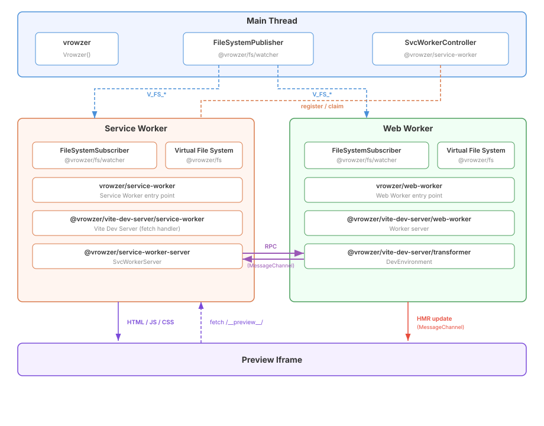

# vrowzer

Vite dev server in the browser.

Embeddable live preview system with HMR support. Mount a Vite-powered preview iframe into your app with a simple API — no back-end server required.

## 💿 Installation

```sh
# npm
npm install vrowzer

# pnpm
pnpm add vrowzer

# yarn
yarn add vrowzer
```

You also need the Vite plugin:

```sh
pnpm add -D @vrowzer/vite-plugin
```

## 🚀 Usage

### 1. Configure Vite

```ts
// vite.config.ts
import { Vrowzer } from '@vrowzer/vite-plugin'
import { defineConfig } from 'vite'

export default defineConfig({
  plugins: [
    Vrowzer({
      serviceWorkerEntry: './node_modules/vrowzer/dist/service-worker.ts'
    })
  ]
})
```

### 2. Use in your app

```ts
import { Vrowzer } from 'vrowzer'

const vrowzer = Vrowzer()

// Initialize with files
const ready = await vrowzer.ready({
  files: {
    '/main.js': `
      document.getElementById('app').innerHTML = '<h1>Hello!</h1>'
      if (import.meta.hot) { import.meta.hot.accept() }
    `
  }
})

if (ready) {
  // Mount preview iframe into a container element
  vrowzer.mount(document.getElementById('preview-container'))
}

// Update files (triggers HMR)
vrowzer.updateFile(
  '/main.js',
  `
  document.getElementById('app').innerHTML = '<h1>Updated!</h1>'
  if (import.meta.hot) { import.meta.hot.accept() }
`
)
```

## 📖 API

### `Vrowzer(options?)`

Creates a new Vrowzer instance.

When `@vrowzer/vite-plugin` is used, configure the preview URL with the plugin's `basePath`. The value is shared with the application, Web Worker, and Service Worker, so the runtime option can be omitted:

```ts
// vite.config.ts
import { Vrowzer as VrowzerPlugin } from '@vrowzer/vite-plugin'
import { defineConfig } from 'vite'

export default defineConfig({
  base: '/app/',
  plugins: [VrowzerPlugin({ basePath: '/app/__preview__/' })]
})
```

```ts
// application.ts
import { Vrowzer } from 'vrowzer'

const vrowzer = Vrowzer()
```

The runtime `basePath` remains available for compatibility and for usage without the plugin. If both the plugin and runtime values are provided, their canonical paths must match or `Vrowzer()` throws. Without either value, the preview path is `/__preview__/`.

`serviceWorkerScope` controls which pages the browser allows the Service Worker to control. When `@vrowzer/vite-plugin` is used, configure the scope on the plugin so the registration and `Service-Worker-Allowed` response header use the same value. The runtime option can then be omitted:

```ts
// vite.config.ts
VrowzerPlugin({ serviceWorkerScope: '/app/' })

// application.ts
const vrowzer = Vrowzer()
```

The runtime `serviceWorkerScope` remains available for compatibility and for builds without the plugin. If both values are provided, they must match or `Vrowzer()` throws before registration. Without either value, the scope defaults to `/`. The scope does not set the preview URL; that is the role of `basePath`.

The scope selects which pages the Service Worker controls, not which request URLs it receives from those pages. Vrowzer only responds to same-origin HTTP(S) requests within `basePath`. Cross-origin requests and same-origin requests outside `basePath` are left to the browser's native network path.

`serviceWorkerVersion` identifies the Service Worker version expected by the controller and reported by the worker. When `@vrowzer/vite-plugin` is used, configure the version on the plugin and omit the runtime option:

```ts
// vite.config.ts
VrowzerPlugin({ serviceWorkerVersion: 'app-v2' })

// application.ts
const vrowzer = Vrowzer()
```

The runtime `serviceWorkerVersion` remains available for compatibility and for builds without the plugin. If both values are provided, they must match or `Vrowzer()` throws before registration. Without either value, the version defaults to `vrowzer-v1`. The resolved version is also reflected in the Service Worker script URL, so changing it may trigger a Service Worker update.

`serviceWorkerReadyTimeout` controls how long the runtime waits for the Service Worker to become the page controller. It defaults to 60000 milliseconds and can be extended for large bundles or slow environments:

```ts
const vrowzer = Vrowzer({ serviceWorkerReadyTimeout: 120000 })
```

This timeout does not apply to Service Worker listen readiness or Web Worker setup, and it does not need a corresponding Vite plugin option.

`webWorkerSetupTimeout` controls the complete Web Worker setup deadline, from Worker creation until the runtime receives the setup acknowledgement. It defaults to 90000 milliseconds and includes loading the transformer and preparing the client files:

```ts
const vrowzer = Vrowzer({ webWorkerSetupTimeout: 120000 })
```

Set this option to `0` for an immediate timeout. It does not apply to Service Worker readiness and does not need a corresponding Vite plugin option.

**Options:**

| Option                      | Type     | Default                           | Description                                                  |
| --------------------------- | -------- | --------------------------------- | ------------------------------------------------------------ |
| `basePath`                  | `string` | Plugin value or `'/__preview__/'` | Preview URL pathname; must match the plugin value             |
| `serviceWorkerVersion`      | `string` | Plugin value or `'vrowzer-v1'`    | SW version; must match the plugin value                       |
| `serviceWorkerScope`        | `string` | Plugin value or `'/'`             | SW registration scope; must match the plugin value            |
| `serviceWorkerReadyTimeout` | `number` | `60000`                           | Milliseconds to wait for the Service Worker page controller   |
| `webWorkerSetupTimeout`     | `number` | `90000`                           | Milliseconds from Web Worker creation through setup completion |

### Instance Methods

#### `ready(config): Promise<boolean>`

Initializes the preview system: creates Web Worker and Service Worker, establishes a MessageChannel between them, and syncs initial files.

```ts
const ready = await vrowzer.ready({
  files: {
    '/main.js': 'console.log("hello")',
    '/style.css': 'body { color: red }'
  }
})
```

#### `mount(container): void`

Mounts a preview iframe into the given DOM element. The iframe uses `credentialless` and `sandbox="allow-scripts allow-same-origin"` attributes, and loads content via the Service Worker using a `srcdoc` bootstrap.

```ts
vrowzer.mount(document.getElementById('preview'))
```

#### `updateFile(path, content): void`

Updates a file in the virtual filesystem. Triggers HMR if the preview supports it.

```ts
vrowzer.updateFile('/main.js', 'console.log("updated")')
```

#### `addFile(path, content): void`

Adds a new file to the virtual filesystem.

#### `deleteFile(path): void`

Deletes a file from the virtual filesystem.

#### `reloadPreview(): void`

Reloads the preview iframe.

## 🏗️ Architecture



## 📚 API References

See the [API References](./docs/index.md)

## 🤝 Sponsors

<p align="center">
  <a href="https://cdn.jsdelivr.net/gh/kazupon/sponsors/sponsors.svg">
    
  </a>
</p>

## ©️ License

[MIT](http://opensource.org/licenses/MIT)
