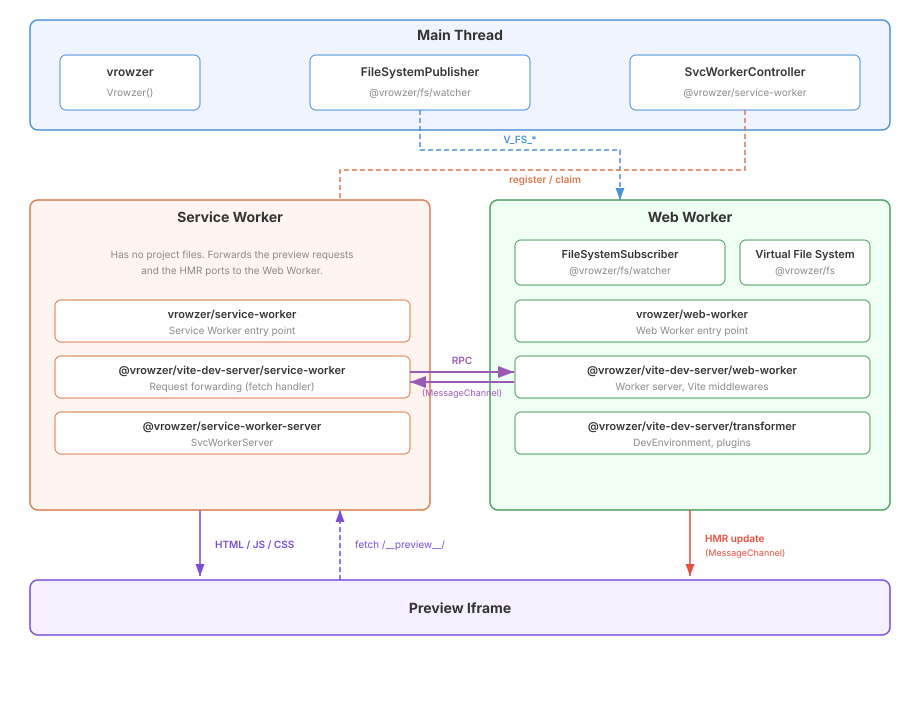

# vrowzer

Vite dev server in the browser.

Embeddable live preview system with HMR support. Mount a Vite-powered preview iframe into your app with a simple API — no back-end server required.

## 💿 Installation

```sh
# npm
npm install vrowzer

# pnpm
pnpm add vrowzer

# yarn
yarn add vrowzer
```

You also need the Vite plugin:

```sh
pnpm add -D @vrowzer/vite-plugin
```

## 🚀 Usage

### 1. Configure Vite

```ts
// vite.config.ts
import { Vrowzer } from '@vrowzer/vite-plugin'
import { defineConfig } from 'vite'

export default defineConfig({
  plugins: [
    Vrowzer({
      serviceWorkerEntry: './node_modules/vrowzer/dist/service-worker.ts'
    })
  ]
})
```

### 2. Use in your app

```ts
import { Vrowzer } from 'vrowzer'

const vrowzer = Vrowzer()

// Initialize with files
const ready = await vrowzer.ready({
  files: {
    '/main.js': `
      document.getElementById('app').innerHTML = '<h1>Hello!</h1>'
      if (import.meta.hot) { import.meta.hot.accept() }
    `
  }
})

if (ready) {
  // Mount preview iframe into a container element
  vrowzer.mount(document.getElementById('preview-container'), { id: 'preview' })
}

// Update files (triggers HMR). The promise resolves when later preview requests see the change.
await vrowzer.updateFile(
  '/main.js',
  `
  document.getElementById('app').innerHTML = '<h1>Updated!</h1>'
  if (import.meta.hot) { import.meta.hot.accept() }
`
)
```

## 📖 API

### `Vrowzer(options?)`

Creates a new Vrowzer instance.

When `@vrowzer/vite-plugin` is used, configure the preview URL with the plugin's `basePath`. The value is shared with the application, Web Worker, and Service Worker, so the runtime option can be omitted:

```ts
// vite.config.ts
import { Vrowzer as VrowzerPlugin } from '@vrowzer/vite-plugin'
import { defineConfig } from 'vite'

export default defineConfig({
  base: '/app/',
  plugins: [VrowzerPlugin({ basePath: '/app/__preview__/' })]
})
```

```ts
// application.ts
import { Vrowzer } from 'vrowzer'

const vrowzer = Vrowzer()
```

The runtime `basePath` remains available for compatibility and for usage without the plugin. If both the plugin and runtime values are provided, their canonical paths must match or `Vrowzer()` throws. Without either value, the preview path is `/__preview__/`.

`serviceWorkerScope` controls which pages the browser allows the Service Worker to control. When `@vrowzer/vite-plugin` is used, configure the scope on the plugin so the registration and `Service-Worker-Allowed` response header use the same value. The runtime option can then be omitted:

```ts
// vite.config.ts
VrowzerPlugin({ serviceWorkerScope: '/app/' })

// application.ts
const vrowzer = Vrowzer()
```

The runtime `serviceWorkerScope` remains available for compatibility and for builds without the plugin. If both values are provided, they must match or `Vrowzer()` throws before registration. Without either value, the scope defaults to `/`. The scope does not set the preview URL; that is the role of `basePath`.

The scope selects which pages the Service Worker controls, not which request URLs it receives from those pages. Vrowzer only responds to same-origin HTTP(S) requests within `basePath`. Cross-origin requests and same-origin requests outside `basePath` are left to the browser's native network path. The Service Worker forwards the requests within `basePath` to the Web Worker, which answers them. Those that the virtual project cannot serve get a 404 response; they are not sent to the host server.

`serviceWorkerVersion` identifies the Service Worker version expected by the controller and reported by the worker. When `@vrowzer/vite-plugin` is used, configure the version on the plugin and omit the runtime option:

```ts
// vite.config.ts
VrowzerPlugin({ serviceWorkerVersion: 'app-v2' })

// application.ts
const vrowzer = Vrowzer()
```

The runtime `serviceWorkerVersion` remains available for compatibility and for builds without the plugin. If both values are provided, they must match or `Vrowzer()` throws before registration. Without either value, the version defaults to `vrowzer-v1`. The resolved version is also reflected in the Service Worker script URL, so changing it may trigger a Service Worker update.

`serviceWorkerReadyTimeout` controls how long the runtime waits for the Service Worker to become the page controller. It defaults to 60000 milliseconds and can be extended for large bundles or slow environments:

```ts
const vrowzer = Vrowzer({ serviceWorkerReadyTimeout: 120000 })
```

This timeout does not apply to Service Worker listen readiness or Web Worker setup, and it does not need a corresponding Vite plugin option.

`webWorkerSetupTimeout` controls the complete Web Worker setup deadline, from Worker creation until the runtime receives the setup acknowledgement. It defaults to 90000 milliseconds and includes loading the transformer and preparing the client files:

```ts
const vrowzer = Vrowzer({ webWorkerSetupTimeout: 120000 })
```

Set this option to `0` for an immediate timeout. It does not apply to Service Worker readiness and does not need a corresponding Vite plugin option.

`fileSyncTimeout` controls how long `addFile()`, `updateFile()` and `deleteFile()` wait for the Web Worker to apply a change. It defaults to 10000 milliseconds. The Web Worker applies a change after the plugins' `watchChange` hooks finish, so slow plugins make it take longer. The default is shorter than the 30 seconds that the Service Worker waits for the Web Worker to answer a request, so in such environments an operation can reject although the change is applied later. Increase the timeout there:

```ts
const vrowzer = Vrowzer({ fileSyncTimeout: 30000 })
```

The same timeout limits how long Vrowzer takes to connect a restarted Service Worker to the Web Worker again. See [Service Worker restarts](#service-worker-restarts).

**Options:**

| Option                      | Type     | Default                           | Description                                                  |
| --------------------------- | -------- | --------------------------------- | ------------------------------------------------------------ |
| `basePath`                  | `string` | Plugin value or `'/__preview__/'` | Preview URL pathname; must match the plugin value             |
| `serviceWorkerVersion`      | `string` | Plugin value or `'vrowzer-v1'`    | SW version; must match the plugin value                       |
| `serviceWorkerScope`        | `string` | Plugin value or `'/'`             | SW registration scope; must match the plugin value            |
| `serviceWorkerReadyTimeout` | `number` | `60000`                           | Milliseconds to wait for the Service Worker page controller   |
| `webWorkerSetupTimeout`     | `number` | `90000`                           | Milliseconds from Web Worker creation through setup completion |
| `fileSyncTimeout`           | `number` | `10000`                           | Milliseconds to wait for the Web Worker to apply a file change, or to reconnect a restarted Service Worker |

### Instance Methods

#### `ready(config): Promise<boolean>`

Initializes the preview system: creates Web Worker and Service Worker, gives the initial files to the Web Worker, and establishes a MessageChannel between them.
Call this method once per Vrowzer instance. Use one initialized Vrowzer instance per page and share it with every preview session.

```ts
const ready = await vrowzer.ready({
  files: {
    '/main.js': 'console.log("hello")',
    '/style.css': 'body { color: red }'
  }
})
```

File contents can be strings or `ArrayBuffer`s. Each `ArrayBuffer` is copied for the Web Worker when `ready()` is called, so the caller's buffer stays usable.

If `files` has no `/index.html`, Vrowzer uses a default one: an empty `<div id="app">` and a module script that loads `/main.js`.

#### `mount(container, options): PreviewSession`

Mounts a preview iframe into the given DOM element. `options.id` is a host-defined, non-empty pane identity. Mounting the same ID again returns the existing session without moving or reloading its iframe; the first container and params remain in effect.

```ts
const desktop = vrowzer.mount(document.getElementById('desktop'), {
  id: 'desktop',
  params: { viewport: 'desktop' }
})
const mobile = vrowzer.mount(document.getElementById('mobile'), {
  id: 'mobile',
  params: { viewport: 'mobile' }
})
```

Each iframe uses `credentialless` and `sandbox="allow-scripts allow-same-origin"`, and loads content through a `srcdoc` bootstrap. Before preview scripts run, Vrowzer exposes the session context through `window.__VROWZER_PREVIEW__` and `document.documentElement.dataset.vrowzerPreviewId`.

```ts
const { id, params } = window.__VROWZER_PREVIEW__!
```

Changing host focus does not affect a session. Keep the session mounted to preserve its current document.

#### `getSession(id): PreviewSession | undefined`

Returns the currently mounted session for a host-defined ID.

#### `sessions(): readonly PreviewSession[]`

Returns a frozen snapshot of all currently mounted sessions.

#### `reloadPreview(target?): void`

Reloads the session selected by an ID or `PreviewSession`. Omitting the target reloads every mounted session.

```ts
vrowzer.reloadPreview(mobile)
desktop.reload()
vrowzer.reloadPreview()
```

#### `unmount(target?): void`

Removes the selected session iframe and its HMR client. Omitting the target unmounts every iframe. The shared Service Worker, Web Worker, and virtual filesystem remain ready. To release the whole instance, use [`dispose()`](#dispose-promisevoid).

```ts
vrowzer.unmount('mobile')
desktop.unmount()
vrowzer.unmount()
```

#### `updateFile(path, content): Promise<void>`

Updates a file in the virtual filesystem. Triggers HMR if the preview supports it.

```ts
await vrowzer.updateFile('/main.js', 'console.log("updated")')
```

#### `addFile(path, content): Promise<void>`

Adds a new file to the virtual filesystem.

#### `deleteFile(path): Promise<void>`

Deletes a file from the virtual filesystem. Deleting a file that does not exist resolves as well.

#### Waiting for file changes

The promise of `addFile()`, `updateFile()` and `deleteFile()` resolves when later preview requests see the change: the Web Worker has written the file to its virtual filesystem, and invalidated the modules that depend on it. It does not wait for HMR updates of mounted previews. To load the new contents in a fresh document, wait for the promise before reloading:

```ts
await vrowzer.updateFile('/main.js', source)
vrowzer.reloadPreview()
```

- Operations awaited one after another are applied in that order. Operations started together may resolve in any order, and several files are not applied as one transaction.
- `ArrayBuffer` content is copied for the Web Worker, so the caller's buffer stays usable.
- The promise rejects without sending the change before `ready()` resolves to `true`, after it fails, and after `dispose()`. It also rejects when the Web Worker fails to apply the change (for example, a plugin's `watchChange` hook throws), when it reports an error, when it does not reply within `fileSyncTimeout`, or when the instance is disposed first. The error message names the operation and the path.
- After a rejection, the change may be partly applied. Write the file again, or delete it, to resynchronize.
- A Service Worker restart does not delay the change, since the Web Worker applies it. See [Service Worker restarts](#service-worker-restarts).

> [!NOTE]
> Up to vrowzer 0.4.x, these methods returned `void` without waiting for the Workers, and calls made before `ready()` completed were dropped or reached only the Web Worker.

#### `dispose(): Promise<void>`

Disposes the instance when the host application stops using it. The promise resolves after these resources are released:

- every preview session, as with `unmount()`
- the instance's Web Worker, with the project files
- the forwarding of Service Worker controller events
- all event handlers, which are removed as soon as `dispose()` is called

The Service Worker registration is shared with other clients and is kept, so a new instance can start right away.

```ts
await vrowzer.dispose()
```

With `await using`, the instance is disposed at the end of the scope.

```ts
{
  await using scoped = Vrowzer()
  await scoped.ready({ files })
  // ...
} // scoped.dispose() completes here
```

- If `ready()` is still in progress, it is aborted and resolves to `false`.
- If Vrowzer is connecting a restarted Service Worker to the Web Worker again, it stops.
- File operations still waiting for the Web Worker reject. After disposal, `ready()`, `addFile()`, `updateFile()` and `deleteFile()` reject, `mount()` throws, and `unmount()` and `reloadPreview()` do nothing. Create a new instance to start again.
- Calling `dispose()` again returns the same promise. If some resources cannot be released, the remaining ones are still released, and the promise rejects with an `AggregateError`.

> [!NOTE]
> Up to vrowzer 0.4.x, `dispose()` only removed the event handlers and returned `void`.

### Events

A Vrowzer instance is an event emitter: `on()` subscribes to an event and returns a function that stops the subscription. Besides the events below, the instance forwards the Service Worker controller events (`progress`, `reloadSuggested`, `changeState`, `suspended`, `terminated` and `resumed`).

#### `previewLoadError`

Emitted when a preview document fails to load before its application code starts: the preview HTML cannot be fetched or returns an error status, or one of its initial scripts fails to load. Subscribe before `mount()` to receive failures that happen right after mounting.

```ts
vrowzer.on('previewLoadError', info => {
  console.error(`Preview "${info.id}" failed to load (${info.stage}): ${info.message}`)
})
```

| Property  | Type                             | Description                                                      |
| --------- | -------------------------------- | ---------------------------------------------------------------- |
| `id`      | `string`                         | ID of the preview session that failed to load                    |
| `stage`   | `'html' \| 'script'`             | Fetching the preview HTML, or loading one of its initial scripts |
| `message` | `string`                         | Summary of the failure, present even without browser details     |
| `url`     | `string \| undefined`            | Requested URL, when known                                        |
| `status`  | `number \| undefined`            | HTTP status, when a response was received                        |
| `error`   | `{ name, message } \| undefined` | The original exception, when one was thrown                      |

The session stays mounted and its rendering does not change: an error response body is still shown, and the remaining scripts still run. After fixing the files, reload the session with `reloadPreview(info.id)`; `ready()` does not need to run again. Errors thrown by the application at runtime are not reported by this event.

#### `serviceWorkerRecovered`

Emitted when Vrowzer has connected a restarted Service Worker to the Web Worker again. See [Service Worker restarts](#service-worker-restarts).

```ts
vrowzer.on('serviceWorkerRecovered', () => {
  console.info('The Service Worker restarted, and the preview is available again')
})
```

#### `serviceWorkerRecoveryError`

Emitted with an `Error` when Vrowzer could not connect a restarted Service Worker to the Web Worker again within `fileSyncTimeout`. See [Service Worker restarts](#service-worker-restarts).

### Service Worker restarts

Browsers stop an idle Service Worker and start it again for the next request or message. The registration and the page controller stay the same, but the restarted Service Worker has lost its channel to the Web Worker. The project files are in the Web Worker, which keeps them. Vrowzer connects the channel again without reloading the host page:

1. When the Service Worker starts again, it notifies the pages it controls.
2. Vrowzer connects the Web Worker channel again.
3. Vrowzer emits `serviceWorkerRecovered`.

While the channel is being connected:

- Preview requests wait for the Web Worker channel, for up to 10 seconds. After that, they get a `503` response, which a loading preview reports with `previewLoadError`.
- `addFile()`, `updateFile()` and `deleteFile()` go on as usual, since the Web Worker applies them.
- Mounted previews keep their HMR connection, which does not go through the Service Worker.

If the channel is not connected within `fileSyncTimeout`, Vrowzer emits `serviceWorkerRecoveryError`, and tries again when the Service Worker restarts the next time. To start over right away, dispose the instance and create a new one:

```ts
vrowzer.on('serviceWorkerRecoveryError', async error => {
  console.error(error)
  await vrowzer.dispose()
  // Create a new instance, and call ready() with the files again
})
```

## 🏗️ Architecture



The Web Worker runs the Vite dev server: it has the project files, the module graph and the plugins, and answers the preview requests with the Vite middlewares, including the ones that plugins add in `configureServer`. The Service Worker has no project files. It forwards the requests within `basePath` to the Web Worker over a MessageChannel, and the HMR ports of the previews as well.

Give Vite plugins to the Web Worker, as `@vrowzer/vite-plugin` does with the plugins of `vite.config.ts`. The Service Worker runs no plugins.

> [!NOTE]
> Up to vrowzer 0.4.x, the Service Worker ran the Vite middlewares on its own copy of the project files, and `initServiceWorker()` of `vrowzer/service-worker-core` took `plugins` for its dev server. The Web Worker's dev server had no `middlewares`, so the middlewares that plugins add in `configureServer` ran only in the Service Worker, for the plugins given to it.

## 📚 API References

See the [API References](./docs/index.md)

## 🤝 Sponsors

<p align="center">
  <a href="https://cdn.jsdelivr.net/gh/kazupon/sponsors/sponsors.svg">
    
  </a>
</p>

## ©️ License

[MIT](http://opensource.org/licenses/MIT)
